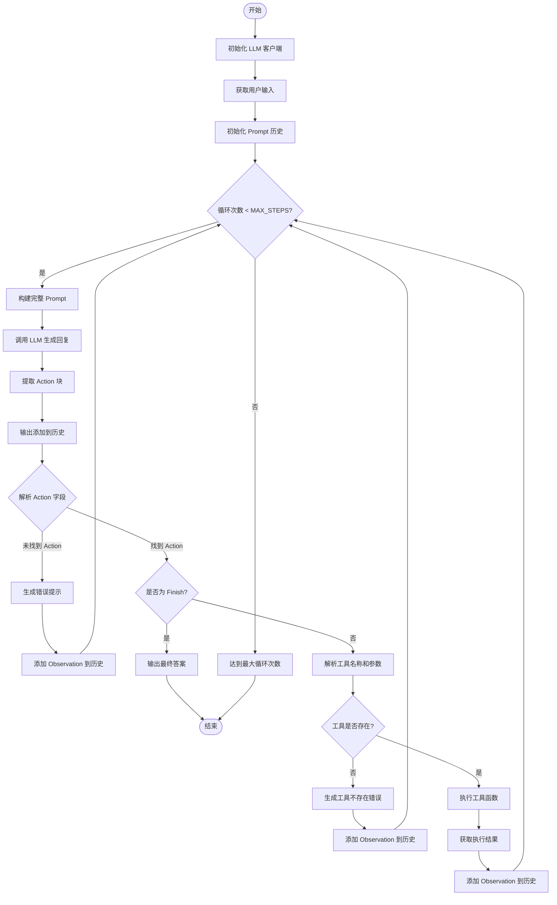

# Travel Agent 代码流程分析

## 概述

这是一个基于 **ReAct (Reasoning + Acting)** 模式实现的旅游助手 Agent。Agent 通过循环调用 LLM 进行推理，并根据推理结果执行相应的工具函数，最终完成用户的旅游查询任务。

## 核心架构

### 主要组件

1. **LLM 客户端** (`OpenAICompatibleClient`)：负责与大语言模型交互
2. **工具集合**：提供具体功能的函数
   - `get_weather`：查询天气信息
   - `get_attraction`：查询旅游景点
3. **Prompt 历史管理**：维护对话上下文
4. **Action 解析器**：解析 LLM 输出的动作指令

## 执行流程图



## 详细流程说明

### 1. 初始化阶段

```python
llm = build_llm_client()              # 创建 LLM 客户端
user_prompt = get_user_prompt()       # 获取用户输入
prompt_history = [f"用户请求: {user_prompt}"]  # 初始化历史
```

- 从环境变量加载配置（通过 `.env` 文件）
- 支持命令行参数或使用默认提示
- 初始化对话历史列表

### 2. 主循环（ReAct 循环）

每次循环包含以下步骤：

#### Step 1: 构建 Prompt 并调用 LLM

```python
full_prompt = "\n".join(prompt_history)
llm_output = llm.generate(full_prompt, system_prompt=AGENT_SYSTEM_PROMPT)
```

- 将历史记录拼接成完整 prompt
- 使用系统提示词指导 LLM 按照 ReAct 格式输出

#### Step 2: 解析 LLM 输出

```python
llm_output = extract_action_block(llm_output)
```

- 提取 `Thought: ... Action: ...` 块
- 使用正则表达式匹配结构化输出

#### Step 3: 判断动作类型

**情况 A：未找到 Action 字段**
```python
if not action_match:
    observation = "错误: 未能解析到 Action 字段..."
```
- 生成错误提示
- 添加到历史，继续下一轮循环

**情况 B：Finish 动作**
```python
if action_str.startswith("Finish"):
    final_answer = finish_match.group(1)
    return  # 结束程序
```
- 提取最终答案
- 终止循环，输出结果

**情况 C：工具调用**
```python
tool_name, kwargs = parse_action(action_str)
observation = available_tools[tool_name](**kwargs)
```
- 解析工具名称和参数（格式：`tool_name(arg1="value1", arg2="value2")`）
- 执行对应工具函数
- 获取执行结果作为 Observation

#### Step 4: 更新历史

```python
observation_str = f"Observation: {observation}"
prompt_history.append(observation_str)
```

- 将观察结果添加到历史
- 供下一轮循环使用

### 3. 循环终止条件

1. **正常终止**：LLM 输出 `Finish[答案]`
2. **异常终止**：达到最大循环次数（`MAX_STEPS = 5`）

## ReAct 模式说明

### 什么是 ReAct？

ReAct = **Reasoning** (推理) + **Acting** (行动)

这是一种让 LLM 交替进行推理和行动的提示工程模式：

1. **Thought**：LLM 思考当前应该做什么
2. **Action**：LLM 决定执行什么动作（调用工具或结束）
3. **Observation**：系统返回动作执行结果
4. 重复 1-3，直到任务完成

### 示例交互流程

```
用户请求: 查询北京天气并推荐景点

--- 循环 1 ---
Thought: 需要先查询北京的天气
Action: get_weather(city="北京")
Observation: 北京今天晴天，温度 25°C

--- 循环 2 ---
Thought: 天气不错，可以推荐户外景点
Action: get_attraction(city="北京", weather="晴天")
Observation: 推荐故宫、天坛等景点

--- 循环 3 ---
Thought: 已获取所有信息，可以给出最终答案
Action: Finish[北京今天晴天25°C，推荐游览故宫和天坛]
```

## 关键函数说明

### `extract_action_block(llm_output: str) -> str`

从 LLM 的完整输出中提取 `Thought + Action` 块，避免多余内容干扰解析。

### `parse_action(action_text: str) -> Tuple`

解析 Action 字符串，提取工具名称和参数：
- 输入：`get_weather(city="北京")`
- 输出：`("get_weather", {"city": "北京"})`

### `main()`

主控制流程，管理整个 Agent 的生命周期。

## 配置说明

### 环境变量（.env 文件）

```bash
OPENAI_API_KEY=your_api_key
OPENAI_BASE_URL=https://api.openai.com/v1
MODEL_NAME=gpt-4
```

### 可调参数

- `MAX_STEPS = 5`：最大循环次数，防止无限循环
- `DEFAULT_USER_PROMPT`：默认用户输入
- `AGENT_SYSTEM_PROMPT`：系统提示词（定义在 `system_prompt.py`）

## 扩展方式

### 添加新工具

1. 实现工具函数：
```python
def get_hotel(city: str, price_range: str) -> str:
    # 实现逻辑
    return "酒店信息"
```

2. 注册到工具集合：
```python
available_tools = {
    "get_weather": get_weather,
    "get_attraction": get_attraction,
    "get_hotel": get_hotel,  # 新增
}
```

3. 更新系统提示词，告知 LLM 新工具的用法

## 优缺点分析

### 优点

- **简单直观**：代码结构清晰，易于理解
- **可扩展**：添加新工具只需注册函数
- **可控性强**：通过循环次数限制防止失控
- **可观测**：每步输出都可见，便于调试

### 缺点

- **效率较低**：每次循环都需要调用 LLM
- **成本较高**：多次 LLM 调用增加 API 费用
- **容错性弱**：依赖 LLM 严格遵循输出格式
- **无状态管理**：不支持复杂的多轮对话状态

## 运行示例

```bash
# 使用默认提示
python main.py

# 自定义输入
python main.py 帮我查询上海的天气并推荐景点
```

## 总结

这是一个经典的 ReAct Agent 实现，通过循环调用 LLM 和工具函数，实现了自主推理和行动的能力。核心思想是让 LLM 不仅生成文本，还能决策执行什么操作，从而完成复杂任务。
